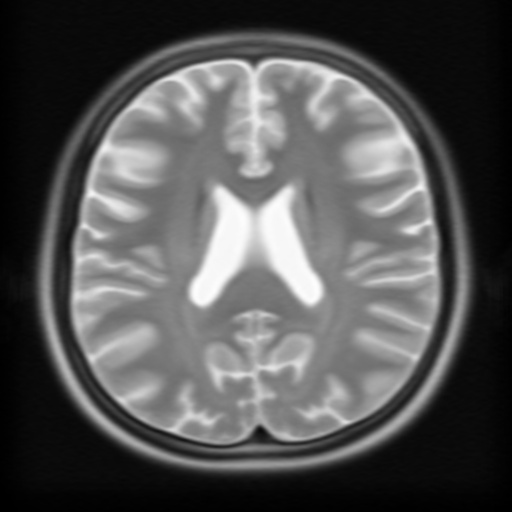
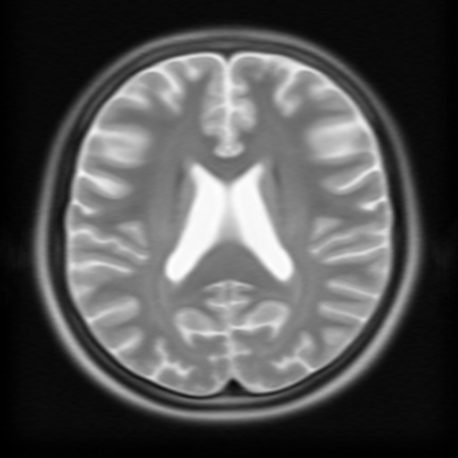

<h2>Tensorflow-Image-Segmentation-Augmented-BigBrainMRICoreg (2024/08/31)</h2>

This is the first experiment of Image Segmentation for BigBrainMRICoreg
 based on
the <a href="https://github.com/sarah-antillia/Tensorflow-Image-Segmentation-API">Tensorflow-Image-Segmentation-API</a>, and
<a href="https://drive.google.com/file/d/1hfbLBx8DHda_-Ke3q7zpmt5ULpP1gkqh/view?usp=sharing">
BigBrain-ICBM2009asym-ImageMask-Dataset.zip</a>, which was derived by us from <b>sub-ICBM2009asym</b> of  
<a href="https://openneuro.org/datasets/ds002016/versions/1.0.0">
BigBrainMRICoreg
</a>
 
 
<b>Data Augmentation Strategy:</b> 
 To address the limited size of the BigBrain-ICBM2009asym dataset, 
 we employed <a href="./src/ImageMaskAugmentor.py">an online augmentation tool</a> to enhance segmentation accuracy, which supports the following aumentation methods.
<li>verticalflip</li>
<li>horizontalflip</li>
<li>rotation</li>
<li>shrinks</li>
<li>shears</li> 
<li>deformation</li>
<li>distortion</li>
<li>barrdistortion</li>
 

<b>Actual Image Segmentation for Images of 512x512 pixels</b> 
As shown below, the inferred masks look similar to the ground truth masks.  

<table>
<tr>
<th>Input: image</th>
<th>Mask (ground_truth)</th>
<th>Prediction: inferred_mask</th>
</tr>
<tr>
<td></td>
<td></td>
<td></td>
</tr>

<tr>
<td></td>
<td></td>
<td></td>
</tr>

<tr>
<td></td>
<td></td>
<td></td>
</tr>

</table>

 
In this experiment, we used the simple UNet Model 
<a href="./src/TensorflowUNet.py">TensorflowSlightlyFlexibleUNet</a> for this BigBrain-ICBM2009asym Segmentation Model. 
As shown in <a href="https://github.com/sarah-antillia/Tensorflow-Image-Segmentation-API">Tensorflow-Image-Segmentation-API</a>.
you may try other Tensorflow UNet Models: 

<li><a href="./src/TensorflowSwinUNet.py">TensorflowSwinUNet.py</a></li>
<li><a href="./src/TensorflowMultiResUNet.py">TensorflowMultiResUNet.py</a></li>
<li><a href="./src/TensorflowAttentionUNet.py">TensorflowAttentionUNet.py</a></li>
<li><a href="./src/TensorflowEfficientUNet.py">TensorflowEfficientUNet.py</a></li>
<li><a href="./src/TensorflowUNet3Plus.py">TensorflowUNet3Plus.py</a></li>
<li><a href="./src/TensorflowDeepLabV3Plus.py">TensorflowDeepLabV3Plus.py</a></li>

 

<h3>1. Dataset Citation</h3>
The original dataset used here has been taken from the web site: 
<a href="https://openneuro.org/datasets/ds002016/versions/1.0.0">
<b>OpenNEURO BigBrainMRICoreg</b>
</a>
  
<b>Authors:</b> 
Yiming Xiao, Jonathan C. Lau, Taylor Anderson, Jordan DeKraker, D. Louis Collins,  
Terry M. Peters, Ali R. Khan 
 
<b>README:</b> 
This dataset includes co-registration of the BigBrain dataset to the MNI PD25 atlas and 
the ICBM152 2009b atlases. The data include deformed BigBrain atlases and manual 
subcortical segmentations in MINC2 and NIFTI-1 formats, as well as relevant spatial transformation 
in MINC transformation format. The segmented subcortical structures include: red nucleus, 
subthalamic nucleus, substantia nigra, caudate, putamen, globus pallidus externa, globus pallidus 
interna, thalamus, hippocampus, nucleus accumbens, and amygdala
 
Note that the described improved co-registration was performed upon the BigBrain data in ICBM space
 from the BigBrain 2015release.
  
<b>License:</b> CC BY4.0 

Within this dataset, the down-sampled versions of BigBrain atlases are distributed under 
the CC BY4.0 License upon the consent from the original data owners, 
the Montreal Neurological Institute (Montreal, Canada) and the Forschungszentrum Jülich (Jülich, Germany). 
However, this exception to the existing BigBrain dataset does not alter the general term of that license 
for use of the BigBrain itself, which is still under the CC BY-NC-SA 4.0 License.

 

<h3>
<a id="2">
2 BigBrain-ICBM2009asym ImageMask Dataset
</a>
</h3>
 If you would like to train this BigBrain Segmentation model by yourself,
 please download the dataset from the google drive 
<a href="https://drive.google.com/file/d/1hfbLBx8DHda_-Ke3q7zpmt5ULpP1gkqh/view?usp=sharing">
BigBrain-ICBM2009asym-ImageMask-Dataset.zip</a>, expand the downloaded ImageMaskDataset and put it under <b>./dataset</b> folder to be
<pre>
./dataset
└─BigBrain-ICBM2009asym
    ├─test
    │   ├─images
    │   └─masks
    ├─train
    │   ├─images
    │   └─masks
    └─valid
        ├─images
        └─masks
</pre>

<b>BigBrain-ICBM2009asym Dataset Statistics</b> 
 
 
As shown above, the number of images of train and valid datasets is not enough to use for a training set for our segmentation model, 
therefore we used an online augmentation tool <a href="./src/ImageMaskAugmentor.py">ImageMaskAugmentor.py</a> 
to improve generalization performance.
  
If you would like to re-create BigBrain-ICBM2009asym-ImageMask-Dataset or enhance it by yourself, please download the
origina BigBrain dataset from 
<a href="https://openneuro.org/datasets/ds002016/versions/1.0.0">
<b>OpenNEURO BigBrainMRICoreg</b>
</a>
<pre>
./BigBrain
├─sub-BigBrain
│  └─anat
├─sub-ICBM2009asym
│  └─anat
├─sub-ICBM2009sym
│  └─anat
└─sub-PD25
    └─anat
</pre>
We created our BigBrain-ICBM2009asym-ImageMask-Dataset from sub-ICBM2009asym of BigBrain by using 
<a href="./generator/ImageMaskDatasetGenerator.py">ImageMaskDatasetGenerator.py</a> 

 
<b>Train_images_sample</b> 

 
<b>Train_masks_sample</b> 

 

<h3>
3 Train TensorflowUNet Model
</h3>
 We have trained BigBrain-ICBM2009asymTensorflowUNet Model by using the following
<a href="./projects/TensorflowSlightlyFlexibleUNet/BigBrain-ICBM2009asym/train_eval_infer.config"> <b>train_eval_infer.config</b></a> file.  
Please move to ./projects/TensorflowSlightlyFlexibleUNet/BigBrain-ICBM2009asym and run the following bat file. 
<pre>
>1.train.bat
</pre>
, which simply runs the following command. 
<pre>
>python ../../../src/TensorflowUNetTrainer.py ./train_eval_infer.config
</pre>

<pre>
; train_eval_infer.config
; 2024/08/31 (C) antillia.com

[model]
model          = "TensorflowUNet"
generator      = True
image_width    = 512
image_height   = 512
image_channels = 3
input_normalize = False
normalization  = False
num_classes    = 1
base_filters   = 16
base_kernels   = (7,7)
num_layers     = 8
dropout_rate   = 0.05
learning_rate  = 0.0001
clipvalue      = 0.5
dilation       = (1,1)
;loss           = "bce_iou_loss"
loss           = "bce_dice_loss"
metrics        = ["dice_coef"]
show_summary   = False

[dataset]
datasetclass  = "ImageMaskDataset"
;Please specify a resize interpolation algorithm in case of ImageMaskDatast.
resize_interpolation = "cv2.INTER_CUBIC"

[train]
epochs        = 100
batch_size    = 2
steps_per_epoch  = 320
validation_steps = 80
patience      = 10

;metrics       = ["iou_coef", "val_iou_coef"]
metrics       = ["dice_coef", "val_dice_coef"]

model_dir     = "./models"
eval_dir      = "./eval"
image_datapath = "../../../dataset/BigBrain-ICBM2009asym/train/images/"
mask_datapath  = "../../../dataset/BigBrain-ICBM2009asym/train/masks/"

epoch_change_infer     = True
epoch_change_infer_dir = "./epoch_change_infer"
epoch_change_tiledinfer     = False
epoch_change_tiledinfer_dir = "./epoch_change_tiledinfer"
num_infer_images       = 1

create_backup  = False

learning_rate_reducer = True
reducer_factor     = 0.4
reducer_patience   = 4
save_weights_only  = True

[eval]
image_datapath = "../../../dataset/BigBrain-ICBM2009asym/valid/images/"
mask_datapath  = "../../../dataset/BigBrain-ICBM2009asym/valid/masks/"

[test] 
image_datapath = "../../../dataset/BigBrain-ICBM2009asym/test/images/"
mask_datapath  = "../../../dataset/BigBrain-ICBM2009asym/test/masks/"

[infer] 
images_dir    = "./mini_test/images"
output_dir    = "./mini_test_output"

[tiledinfer] 
overlapping   = 80
images_dir    = "./mini_test/images"
output_dir    = "./mini_test_output_tiled"

[segmentation]
colorize      = True
black         = "black"
white         = "green"
blursize      = None

[image]
color_converter = None
;color_converter = "cv2.COLOR_BGR2HSV_FULL"
gamma           = 0
sharpening      = 0

[mask]
blur      = False
blur_size = (3,3)
binarize  = False
;threshold = 128
threshold = 80

[generator]
debug        = False
augmentation = True

[augmentor]
vflip    = True
hflip    = True
rotation = True
angles   = [30, 60, 90, 120, 150, 180, 210, 240, 270, 300, 330]
shrinks  = [0.8,]
shears   = [0.1]

deformation = True
distortion  = True
sharpening  = False
brightening = False
barrdistortion = True

[deformation]
alpah     = 1300
sigmoids  = [8.0,]

[distortion]
gaussian_filter_rsigma= 40
gaussian_filter_sigma = 0.5
distortions           = [0.02, ]

[barrdistortion]
radius = 0.3
amount = 0.3
centers =  [(0.3, 0.3), (0.7, 0.3), (0.5, 0.5), (0.3, 0.7), (0.7, 0.7)]

[sharpening]
k        = 1.0

[brightening]
alpha  = 1.2
beta   = 10  
</pre>

<b>Model parameters</b> 
Defined a small <b>base_filters</b> and large <b>base_kernels</b> for the first Conv Layer of Encoder Block of 
<a href="./src/TensorflowUNet.py">TensorflowUNet.py</a> 
and a large num_layers (including a bridge between Encoder and Decoder Blocks).
<pre>
[model]
base_filters   = 16
base_kernels   = (7,7)
num_layers     = 8
</pre>

<b>Learning rate</b> 
Defined a small learning rate.  
<pre>
[model]
learning_rate  = 0.0001
</pre>

<b>Online augmentation</b> 
Enabled our online augmentation.  
<pre>
[model]
model         = "TensorflowUNet"
generator     = True
</pre>

<b>Loss and metrics functions</b> 
Specified "bce_dice_loss" and "dice_coef". 
<pre>
[model]
loss           = "bce_dice_loss"
metrics        = ["dice_coef"]
</pre>
<b>Learning rate reducer callback</b> 
Enabled learing_rate_reducer callback, and a small reducer_patience.
<pre> 
[train]
learning_rate_reducer = True
reducer_factor     = 0.4
reducer_patience   = 4
</pre>

<b>Early stopping callback</b> 
Enabled early stopping callback with patience parameter.
<pre>
[train]
patience      = 10
</pre>

<b>Epoch change inference callbacks</b> 
Enabled epoch_change_infer and epoch_changeinfer callbacks. 
<pre>
[train]
epoch_change_infer       = True
epoch_change_infer_dir   =  "./epoch_change_infer"
epoch_changeinfer        = False
epoch_changeinfer_dir    = "./epoch_changeinfer"
num_infer_images         = 1
</pre>

By using these callbacks, on every epoch_change, the inference procedures can be called
 for an image in <b>mini_test</b> folder. These will help you confirm how the predicted mask changes 
 at each epoch during your training process.    

<b>Epoch_change_inference output</b> 
 
 
 

In this experiment, the training process was stopped at epoch 55 by EarlyStopping Callback.  
 
 

 
<a href="./projects/TensorflowSlightlyFlexibleUNet/BigBrain-ICBM2009asym/eval/train_metrics.csv">train_metrics.csv</a> 
 

 
<a href="./projects/TensorflowSlightlyFlexibleUNet/BigBrain-ICBM2009asym/eval/train_losses.csv">train_losses.csv</a> 
 

 

<h3>
4 Evaluation
</h3>
Please move to a <b>./projects/TensorflowSlightlyFlexibleUNet/BigBrain-ICBM2009asym</b> folder, 
and run the following bat file to evaluate TensorflowUNet model for BigBrain-ICBM2009asym. 
<pre>
./2.evaluate.bat
</pre>
This bat file simply runs the following command.
<pre>
python ../../../src/TensorflowUNetEvaluator.py ./train_eval_infer_aug.config
</pre>

Evaluation console output: 

  

<a href="./projects/TensorflowSlightlyFlexibleUNet/BigBrain-ICBM2009asym/evaluation.csv">evaluation.csv</a> 

The loss (bce_dice_loss) to this BigBrain-ICBM2009asym/test was low, and dice_coef not relatively high as shown below.
 
<pre>
loss,0.0945
dice_coef,0.8446
</pre>

<h3>
5 Inference
</h3>
Please move to a <b>./projects/TensorflowSlightlyFlexibleUNet/BigBrain-ICBM2009asym</b> folder 
,and run the following bat file to infer segmentation regions for images by the Trained-TensorflowUNet model for BigBrain-ICBM2009asym. 
<pre>
./3.infer.bat
</pre>
This simply runs the following command.
<pre>
python ../../../src/TensorflowUNetInferencer.py ./train_eval_infer_aug.config
</pre>

<b>mini_test_images</b> 
 
<b>mini_test_mask(ground_truth)</b> 
 

<b>Inferred test masks</b> 
 
 

<b>Enlarged images and masks </b> 

<table>
<tr>
<th>Image</th>
<th>Mask (ground_truth)</th>
<th>Inferred-mask</th>
</tr>

<tr>
<td></td>
<td></td>
<td></td>
</tr>

<tr>
<td></td>
<td></td>
<td></td>
</tr>

<tr>
<td></td>
<td></td>
<td></td>
</tr>
<tr>
<td></td>
<td></td>
<td></td>
</tr>
<tr>
<td></td>
<td></td>
<td></td>
</tr>

</table>

 
<h3>
References
</h3>
<b>1. BigBrainMRICoreg</b> 

<a href="https://openneuro.org/datasets/ds002016/versions/1.0.0">
https://openneuro.org/datasets/ds002016/versions/1.0.0
</a>
 
Yiming Xiao, Jonathan C. Lau, Taylor Anderson, Jordan DeKraker, D. Louis Collins, Terry M. Peters, Ali R. Khan 
Dataset DOIdoi:10.18112/openneuro.ds002016.v1.0.0 
 

<b>2. An accurate registration of the BigBrain dataset with the MNI PD25 and ICBM152 atlases</b> 
Yiming Xiao, Jonathan C. Lau, Taylor Anderson, Jordan DeKraker, D. Louis Collins, Terry Peters, Ali R. Khan 

<a href="http://dx.doi.org/10.1038/s41597-019-0217-0">http://dx.doi.org/10.1038/s41597-019-0217-0</a>

 

